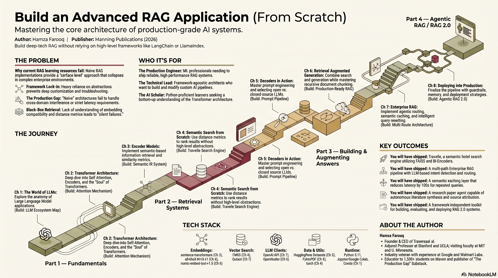
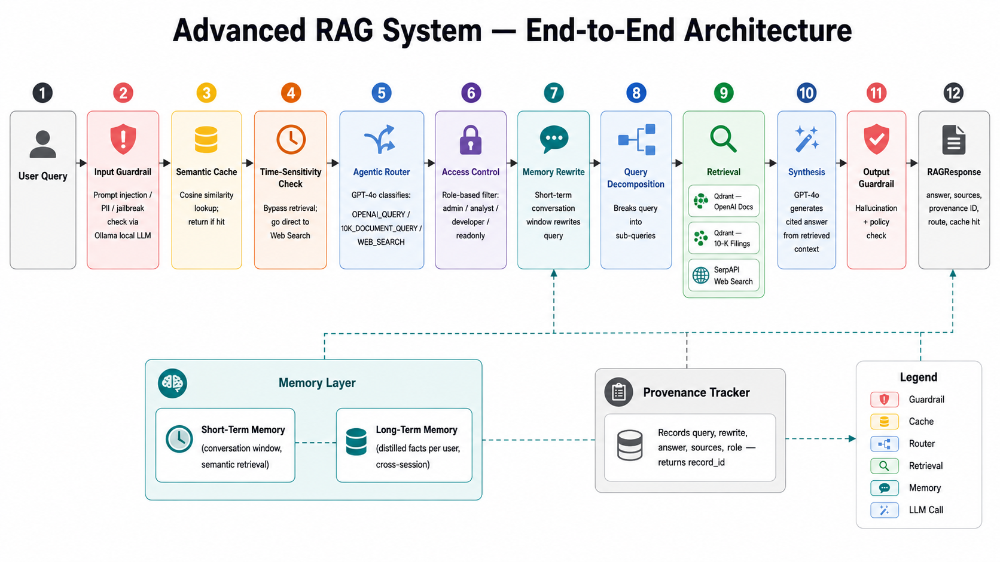

<div align="center">

# Build an Advanced RAG Application (From Scratch)

### Companion code for the Manning book by Hamza Farooq

<a href="https://www.manning.com/books/build-an-advanced-rag-application-from-scratch">
  
</a>

</div>

---

This repo is the official companion code for **[Build an Advanced RAG Application (From Scratch)](https://www.manning.com/books/build-an-advanced-rag-application-from-scratch)** by **Hamza Farooq**, published by **Manning** (MEAP).

The book teaches you to build search and Retrieval-Augmented Generation (RAG) systems **without leaning on Langchain or LlamaIndex** — so you understand every layer.

## 🌟 Features

The goal of this book is to teach you advanced RAG by building each layer from scratch:

- 🔍 **Semantic search engines** — NumPy → FAISS Flat / HNSW / IVF-PQ
- ✍️ **Decoder prompting patterns** — basic, structured, few-shot, chain-of-thought
- 📊 **Full RAG pipelines** — FAISS + Qdrant, on hotel reviews and research papers
- 🧭 **Agentic query routing** — across multiple knowledge bases
- ⚡ **Semantic caching** — paraphrased queries hit
- 🔄 **Query rewriting & decomposition** — for vague or compound questions
- 📚 **Real corpora** — Paris hotel reviews, DBLP research papers, OpenAI agents guide, Uber & Lyft 10-Ks

<div align="center">



</div>

## 🏗️ System Architecture

<div align="center">



</div>

## 📚 Chapters

| # | Chapter | Code | What you'll learn |
|---|---------|------|-------------------|
| 1 | The World of Large Language Models | _conceptual_ | What defines an LLM; applications across generation, classification, translation, and retrieval; the anatomy of an LLM application; the scale and challenges of these models; the startup ecosystem around them. |
| 2 | An in-depth look into the soul of the Transformer Architecture | _conceptual_ | Why Transformers beat RNNs; Self-Attention, Multi-Head Attention, and Positional Encoding; the roles of Encoder and Decoder models, illustrated through real-world Encoder-Decoder use cases. |
| 3 | Encoder Models in Action: Semantic-Based Retrieval Systems | [chapter_03_keyword_semantic_search_basics/](chapter_03_keyword_semantic_search_basics/) | The evolution of information retrieval from keyword to semantic search; chunking for the 512-token BERT limit; building an inverted index with TF-IDF; encoding with `all-MiniLM-L6-v2`; cosine similarity — exact token matching vs. semantic meaning. |
| 4 | Semantic Search from Scratch | [chapter_04_semantic_search/](chapter_04_semantic_search/) | Hand-rolled cosine similarity in NumPy → FAISS exact search → comparing Flat / HNSW / IVF-PQ on the same corpus. |
| 5 | Decoders in Action | [chapter_05_decoders_in_action/](chapter_05_decoders_in_action/) | How prompt structure shapes output: basic vs. structured vs. few-shot vs. Chain-of-Thought, ending on a CoT prompt that analyzes retrieval results. |
| 6 | Retrieval-Augmented Generation (RAG) | [chapter_06_rag/](chapter_06_rag/) | A full retrieve → augment → generate loop, twice: hotel reviews (FAISS → Qdrant + city filter) and research papers (chunking + year filter). |
| 7 | Enterprise RAG: Agentic Routing, Semantic Caching, and Query Rewriting | [chapter_07_enterprise_rag/](chapter_07_enterprise_rag/) | LLM-based router across multiple knowledge bases, FAISS-backed semantic cache, query rewriter and decomposer, all combined into one async pipeline. Real data: OpenAI agents guide + Uber/Lyft 10-Ks. |
| 8 | Deploying RAG into Production | _coming in a future MEAP_ | Operational concerns of shipping RAG: deployment, observability, guardrails, and full agentic orchestration on top of the routing/caching/rewriting foundation. |

The original Colab notebooks (pre-cleanup) are preserved in [colab_original_notebooks/](colab_original_notebooks/) for reference.

## 🔗 Dependencies

### Local dependencies

| Tool | Version | Purpose | Installation Link |
|------|---------|---------|-------------------|
| Python | 3.11 | Runtime | [python.org](https://www.python.org/downloads/) |
| Conda | latest | Environment manager | [Miniconda](https://docs.conda.io/en/latest/miniconda.html) |
| Jupyter Lab | latest | Notebook UI | installed via `requirements.txt` |
| Git | 2.0+ | Version control | [git-scm.com](https://git-scm.com/) |

### Cloud services

| Service | Purpose |
|---------|---------|
| [OpenAI](https://platform.openai.com) | LLM calls in Chapters 5 and 7 |
| [OpenRouter](https://openrouter.ai) | Unified LLM gateway in Chapter 6 |
| [Kaggle](https://www.kaggle.com) | DBLP research-papers dataset download (Chapter 6b) |
| [Qdrant Cloud](https://cloud.qdrant.io) | Persistent vector DB for Chapter 7 (optional — falls back to in-memory) |
| [SerpAPI](https://serpapi.com) | Real Google search for the Chapter 7 web-route (optional) |
| [HuggingFace Hub](https://huggingface.co) | Hosts the `traversaal-ai-hackathon/hotel_datasets` dataset and the `nomic-embed-text-v1.5` embedding model |

## 🗂️ Project Structure

```
advanced-rag-from-scratch/
├── README.md                        # this file
├── requirements.txt                 # all deps in one env
├── .env.example                     # API key template
├── chapter_03_keyword_semantic_search_basics/ # keyword search + semantic search
│   ├── notebook.ipynb               #   walkthrough
│   └── bond_article.txt             #   context-length demo article
├── chapter_04_semantic_search/      # cosine, Euclidean, FAISS Flat/HNSW/IVF-PQ
│   ├── notebook.ipynb               #   walkthrough
│   ├── data_loader.py               #   hotel review loader
│   └── search.py                    #   reusable search helpers
├── chapter_05_decoders_in_action/   # prompting styles
│   ├── notebook.ipynb
│   ├── llm_client.py
│   └── prompts.py
├── chapter_06_rag/                  # full RAG, hotels + papers
│   ├── 06a_rag_pipeline.ipynb       #   FAISS → Qdrant + city filter
│   ├── 06b_research_papers.ipynb    #   chunking + year filter
│   ├── rag_pipeline.py
│   ├── qdrant_helpers.py
│   └── chunking.py
├── chapter_07_enterprise_rag/       # routing, caching, rewriting
│   ├── notebook.ipynb
│   ├── data/                        #   PDFs + 10-K HTM (committed for convenience)
│   ├── agentic_router.py
│   ├── semantic_cache.py
│   ├── query_rewriter.py
│   ├── enterprise_pipeline.py
│   └── ingest.py
└── colab_original_notebooks/        # Colab originals, preserved
```

## 💻 Installation

### 1. Clone the Repository

```bash
git clone https://github.com/hamzafarooq/advanced-rag-from-scratch.git
cd advanced-rag-from-scratch
```

### 2. Set Up Python Environment

```bash
conda create -n advanced-rag python=3.11 -y
conda activate advanced-rag
```

### 3. Install Dependencies

```bash
pip install -r requirements.txt
```

### 4. Register the Jupyter Kernel

```bash
python -m ipykernel install --user --name advanced-rag --display-name "Python (advanced-rag)"
```

In any chapter notebook, select the **Python (advanced-rag)** kernel.

### 5. Configure API Keys

```bash
cp .env.example .env
# then edit .env and fill in your real keys
```

| Key | Required for | Get one at |
|-----|--------------|------------|
| `OPENAI_API_KEY` | Chapters 5, 7 | https://platform.openai.com |
| `OPEN_ROUTER_API_KEY` | Chapter 6 (LLM generation) | https://openrouter.ai |
| `KAGGLE_USERNAME` + `KAGGLE_KEY` | Chapter 6b (DBLP dataset) | https://www.kaggle.com/settings |
| `QDRANT_URL` + `QDRANT_API_KEY` | Chapter 7 (optional) | https://cloud.qdrant.io |
| `SERPAPI_KEY` | Chapter 7 (optional) | https://serpapi.com |

Chapter 4 needs no API keys — it runs locally.

## 🏃 Run project

```bash
conda activate advanced-rag
jupyter lab
```

Open any chapter folder, pick a notebook, and choose the **Python (advanced-rag)** kernel. Each chapter is independent; you can read in any order.

Recommended path: **Chapter 4 → 5 → 6a → 6b → 7**.

## 👤 About the author

**Hamza Farooq** is the founder and CEO of [**Traversaal.ai**](https://traversaal.ai), an enterprise AI agents company. He has 15+ years of machine-learning experience across three continents and seven countries — formerly Senior Research Manager at **Google** and **Walmart Labs**, leading data science and ML teams across tech, telecom, finance, and retail.

Hamza is an adjunct professor at **Stanford** (Continuing Studies), **UCLA**, **MIT**, and the **University of Minnesota**, where he designed and taught Machine Learning System Design in UCLA Anderson's #1 globally-ranked MSBA program. He's taught **1,500+ professionals** through Maven and university programs.

He spearheaded the **LLM Adaptation & Research for General Enterprises (LARGE)** initiative and led the development of an **Urdu LLM** — the first state-of-the-art language model for Urdu, addressing linguistic and cultural inequities in AI.

**Find him at:**

- 🌐 [traversaal.ai](https://traversaal.ai)
- 💼 [LinkedIn](https://www.linkedin.com/in/hamzafarooq/)
- 💻 [GitHub](https://github.com/hamzafarooq)
- 🎓 [Maven courses](https://maven.com/boring-bot) — *Building LLM Applications from Scratch*, *Agent Engineering Bootcamp*, *Agentic AI for Product Managers*
- ✍️ [The Production Gap](https://boringbot.substack.com) on Substack — how to move AI demos to production-grade scale

## 📄 License

See [LICENSE](LICENSE).
