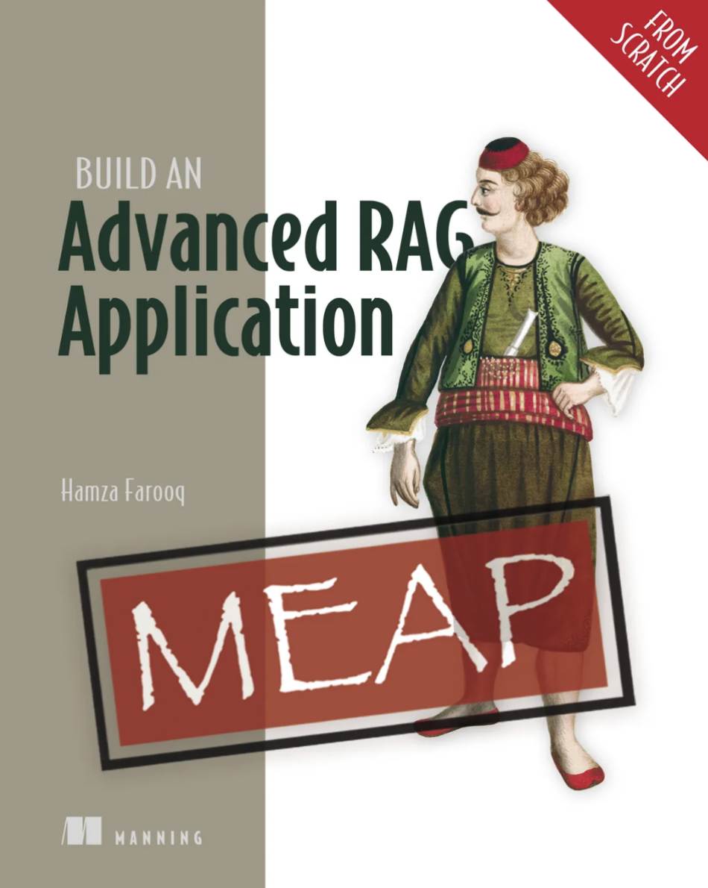

<div align="center">

# Build an Advanced RAG Application (From Scratch)

### Companion code for the Manning book by Hamza Farooq

<a href="https://www.manning.com/books/build-an-advanced-rag-application-from-scratch">
  
</a>

</div>

---

This repo is the official companion code for **[Build an Advanced RAG Application (From Scratch)](https://www.manning.com/books/build-an-advanced-rag-application-from-scratch)** by **Hamza Farooq**, published by **Manning** (MEAP).

The book teaches you to build search and Retrieval-Augmented Generation (RAG) systems **without leaning on Langchain or LlamaIndex** — so you understand every layer.

## What you'll build

- **Semantic search** — from hand-rolled cosine in NumPy through FAISS Flat / HNSW / IVF-PQ
- **Prompted decoders** — basic, structured, few-shot, and Chain-of-Thought prompting patterns
- **Full RAG** — retrieval + generation, on hotel reviews and research papers
- **Enterprise RAG** — agentic routing, semantic caching, query rewriting, all wired into one async pipeline
- **Real corpora** — Paris hotel reviews, DBLP research papers, OpenAI agents guide, Lyft & Uber 10-K filings

## Chapters

| # | Chapter | Code | What you'll learn |
|---|---------|------|-------------------|
| 1 | The World of Large Language Models | _conceptual_ | What defines an LLM; applications across generation, classification, translation, and retrieval; the anatomy of an LLM application; the scale and challenges of these models; the startup ecosystem around them. |
| 2 | An in-depth look into the soul of the Transformer Architecture | _conceptual_ | Why Transformers beat RNNs; Self-Attention, Multi-Head Attention, and Positional Encoding; the roles of Encoder and Decoder models, illustrated through real-world Encoder-Decoder use cases. |
| 3 | Encoder Models in Action: Semantic-Based Retrieval Systems | _conceptual_ | The evolution of information retrieval from keyword to semantic search; how to design a semantic search system end-to-end using encoder models and similarity metrics. |
| 4 | Semantic Search from Scratch | [chapter_04_semantic_search/](chapter_04_semantic_search/) | Hand-rolled cosine similarity in NumPy → FAISS exact search → comparing Flat / HNSW / IVF-PQ on the same corpus. |
| 5 | Decoders in Action | [chapter_05_decoders_in_action/](chapter_05_decoders_in_action/) | How prompt structure shapes output: basic vs. structured vs. few-shot vs. Chain-of-Thought, ending on a CoT prompt that analyzes retrieval results. |
| 6 | Retrieval-Augmented Generation (RAG) | [chapter_06_rag/](chapter_06_rag/) | A full retrieve → augment → generate loop, twice: hotel reviews (FAISS → Qdrant + city filter) and research papers (chunking + year filter). |
| 7 | Enterprise RAG: Agentic Routing, Semantic Caching, and Query Rewriting | [chapter_07_enterprise_rag/](chapter_07_enterprise_rag/) | LLM-based router across multiple knowledge bases, FAISS-backed semantic cache, query rewriter and decomposer, all combined into one async pipeline. Real data: OpenAI agents guide + Uber/Lyft 10-Ks. |
| 8 | Deploying RAG into Production | _coming in a future MEAP_ | Operational concerns of shipping RAG: deployment, observability, guardrails, and full agentic orchestration on top of the routing/caching/rewriting foundation. |

The original Colab notebooks (pre-cleanup) are preserved in [colab_original_notebooks/](colab_original_notebooks/) for reference.

## Setup

### 1. Clone and create the conda env

```bash
git clone https://github.com/hamzafarooq/advanced-rag-from-scratch.git
cd advanced-rag-from-scratch

conda create -n advanced-rag python=3.11 -y
conda activate advanced-rag
pip install -r requirements.txt
```

### 2. Configure API keys

```bash
cp .env.example .env
# then edit .env and fill in your real keys
```

| Key | Required for | Get one at |
|-----|--------------|------------|
| `OPENAI_API_KEY` | Chapters 5, 7 | https://platform.openai.com |
| `OPEN_ROUTER_API_KEY` | Chapter 6 (LLM generation) | https://openrouter.ai |
| `KAGGLE_USERNAME` + `KAGGLE_KEY` | Chapter 6b (DBLP dataset) | https://www.kaggle.com/settings |
| `QDRANT_URL` + `QDRANT_API_KEY` | Chapter 7 (optional — falls back to in-memory) | https://cloud.qdrant.io |
| `SERPAPI_KEY` | Chapter 7 (optional — falls back to a stub) | https://serpapi.com |

Chapter 4 needs no API keys — it runs locally.

### 3. Register the env as a Jupyter kernel

```bash
python -m ipykernel install --user --name advanced-rag --display-name "Python (advanced-rag)"
jupyter lab
```

In any chapter notebook, select the **Python (advanced-rag)** kernel.

## Project structure

```
advanced-rag-from-scratch/
├── README.md                        # this file
├── requirements.txt                 # all deps in one env
├── .env.example                     # API key template
├── chapter_04_semantic_search/      # cosine, Euclidean, FAISS Flat/HNSW/IVF-PQ
│   ├── notebook.ipynb               #   walkthrough
│   ├── data_loader.py               #   hotel review loader
│   └── search.py                    #   reusable search helpers
├── chapter_05_decoders_in_action/   # prompting styles
│   ├── notebook.ipynb
│   ├── llm_client.py
│   └── prompts.py
├── chapter_06_rag/                  # full RAG, hotels + papers
│   ├── 06a_rag_pipeline.ipynb       #   FAISS → Qdrant + city filter
│   ├── 06b_research_papers.ipynb    #   chunking + year filter
│   ├── rag_pipeline.py
│   ├── qdrant_helpers.py
│   └── chunking.py
├── chapter_07_enterprise_rag/       # routing, caching, rewriting
│   ├── notebook.ipynb
│   ├── data/                        #   PDFs + 10-K HTM (committed for convenience)
│   ├── agentic_router.py
│   ├── semantic_cache.py
│   ├── query_rewriter.py
│   ├── enterprise_pipeline.py
│   └── ingest.py
└── colab_original_notebooks/      # Colab originals, preserved
```

## Tech stack

| Layer | Choice | Why |
|-------|--------|-----|
| Embeddings | `nomic-ai/nomic-embed-text-v1.5` (768d) | Strong open-weight embedder; runs locally |
| Vector search | FAISS, Qdrant | FAISS for the from-scratch chapters; Qdrant once metadata filtering matters |
| LLM client | OpenAI SDK against OpenAI and OpenRouter | One client, two endpoints; mix-and-match models |
| Notebooks | Jupyter Lab | The teaching surface |
| Modules | Python 3.11 + `python-dotenv` | Reusable across chapters; secrets via `.env` |

## License

See [LICENSE](LICENSE).

---

*Hamza Farooq — Founder, [Traversaal.ai](https://traversaal.ai). Adjunct Professor, UCLA & Stanford.*
